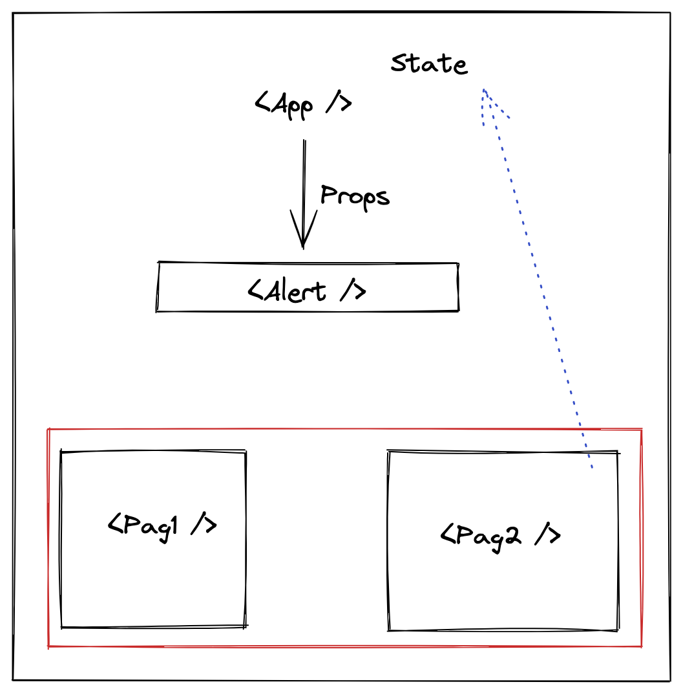
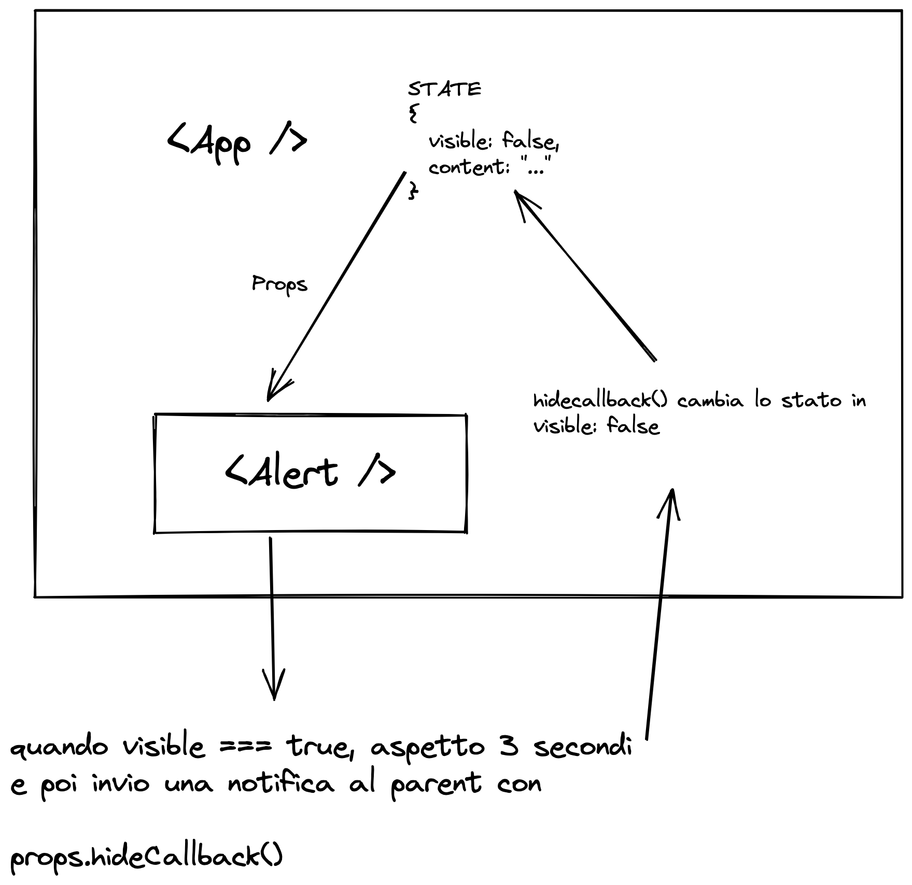

# Edgemony Movie Database

> Movie management SPA built in React for learning purposes.

Live demo:
[https://edgemony-coding-bootcamp.github.io/emdb-react/](https://edgemony-coding-bootcamp.github.io/emdb-react/)

### Requirements

A user of the application must be able to:

- browse all of the available movies
- filter results by searching for title or categories
- add a new movie entry to the DB
- update an existing movie entry
- delete an existing movie entry

### Endpoint and data structure

The main REST API endpoint is `https://edgemony-backend.herokuapp.com/movies`.

the data scheme returned from the endpoint is:

```json
[
  {
    "id": Number,
    "title": String,
    "poster": String,
    "year": Number,
    "genres": Array<String>,
    "description": String
  }
]
```

### Libraries

- [React](https://reactjs.org/) - _A JavaScript library for building user interfaces_
- [React router DOM](https://reactrouter.com/) - _client side routing_
- [date-fns](https://date-fns.org/) - _modern JavaScript date utility library_
- [normalize.css](https://necolas.github.io/normalize.css/) - _a modern, HTML5-ready alternative to CSS resets_
- [CSS Modules](https://github.com/css-modules/css-modules) - _incapsulate styles in components_
- [SASS](https://sass-lang.com/) - _CSS with superpowers_
- [React Icons](https://react-icons.github.io/react-icons/) - _Font Awesome icons adapted for React_

### How to run it locally

1. clone the repo

```
$ git clone git@github.com:edgemony-coding-bootcamp/emdb-react.git
```

2. cd into the folder

```
$ cd emdb-react
```

3. install dependencies

```
$ npm ci
```

4. run the development server

```
$ npm start
```

5. open the browser at `localhost:3000`

### Notification alert flow

Application "bird-eye view" flow


`<App />` component detail


### License

Released under the [MIT license](LICENSE).

---

# Getting Started with Create React App

This project was bootstrapped with [Create React App](https://github.com/facebook/create-react-app).

## Available Scripts

In the project directory, you can run:

### `npm start`

Runs the app in the development mode.\
Open [http://localhost:3000](http://localhost:3000) to view it in your browser.

The page will reload when you make changes.\
You may also see any lint errors in the console.

### `npm test`

Launches the test runner in the interactive watch mode.\
See the section about [running tests](https://facebook.github.io/create-react-app/docs/running-tests) for more information.

### `npm run build`

Builds the app for production to the `build` folder.\
It correctly bundles React in production mode and optimizes the build for the best performance.

The build is minified and the filenames include the hashes.\
Your app is ready to be deployed!

See the section about [deployment](https://facebook.github.io/create-react-app/docs/deployment) for more information.

### `npm run eject`

**Note: this is a one-way operation. Once you `eject`, you can't go back!**

If you aren't satisfied with the build tool and configuration choices, you can `eject` at any time. This command will remove the single build dependency from your project.

Instead, it will copy all the configuration files and the transitive dependencies (webpack, Babel, ESLint, etc) right into your project so you have full control over them. All of the commands except `eject` will still work, but they will point to the copied scripts so you can tweak them. At this point you're on your own.

You don't have to ever use `eject`. The curated feature set is suitable for small and middle deployments, and you shouldn't feel obligated to use this feature. However we understand that this tool wouldn't be useful if you couldn't customize it when you are ready for it.

## Learn More

You can learn more in the [Create React App documentation](https://facebook.github.io/create-react-app/docs/getting-started).

To learn React, check out the [React documentation](https://reactjs.org/).

### Code Splitting

This section has moved here: [https://facebook.github.io/create-react-app/docs/code-splitting](https://facebook.github.io/create-react-app/docs/code-splitting)

### Analyzing the Bundle Size

This section has moved here: [https://facebook.github.io/create-react-app/docs/analyzing-the-bundle-size](https://facebook.github.io/create-react-app/docs/analyzing-the-bundle-size)

### Making a Progressive Web App

This section has moved here: [https://facebook.github.io/create-react-app/docs/making-a-progressive-web-app](https://facebook.github.io/create-react-app/docs/making-a-progressive-web-app)

### Advanced Configuration

This section has moved here: [https://facebook.github.io/create-react-app/docs/advanced-configuration](https://facebook.github.io/create-react-app/docs/advanced-configuration)

### Deployment

This section has moved here: [https://facebook.github.io/create-react-app/docs/deployment](https://facebook.github.io/create-react-app/docs/deployment)

### `npm run build` fails to minify

This section has moved here: [https://facebook.github.io/create-react-app/docs/troubleshooting#npm-run-build-fails-to-minify](https://facebook.github.io/create-react-app/docs/troubleshooting#npm-run-build-fails-to-minify)
